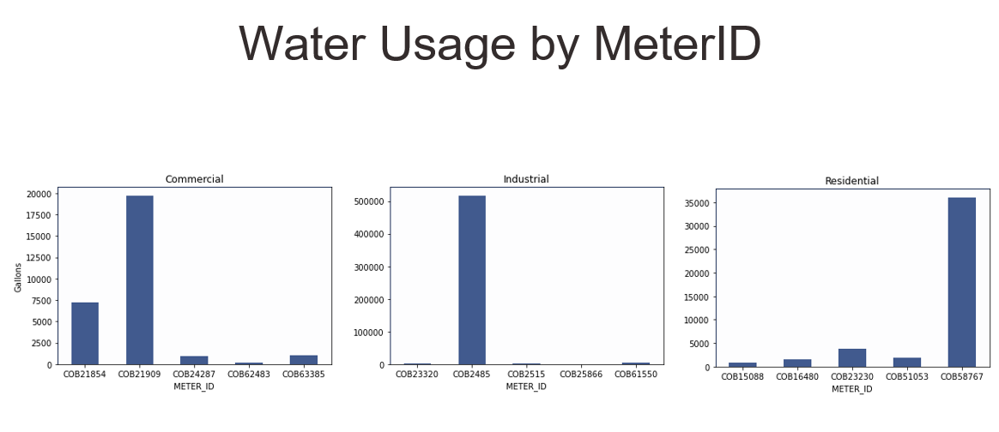

# WaterUsagePrediction

## Problem Statement

Information about potable water usage in the past and the future is crucial for water providers to plan and manage water resources and infrastructure and even shape the usage patterns of customers. Modeling factors affecting water usage is as essential as water usage predictions. The former allows a utility to understand how weather, usage time, and socioeconomic variables drive water usage patterns. The latter enables a water utility to proactively plan and prepare resources and efficiently manage operations. 

Modeling factors that affect and predict water consumption to provide suppliers with information regarding past and future potable water demand will help to understand how socioeconomic factors, weather, and usage time affect water usage trends. 

This enables effective management of operations and planning and preparation of resources in advance as well as address water shortage, better serve underserved communities with deteriorated water infrastructure, and build a sustainable society. 

## Objectives

1) Regression: Examining the impact of variables such as weather, property value, consumer type, and time of use on water consumption.
2) Prediction: Forecasting how water usage will change in the future, such as one week from now.

To answer these questions, we were provided with water usage data and weather data from various sectors.

## Data
Data collected through measurements by specialized meters based on the Advanced Metering Infrastructure (AMI), from 01/01/2020  to 06/22/2022.
The AMI data measures the amount of water consumed by each consumer at certain temporal periods, usually hourly, owing to smart meters and the Internet infrastructure.
The AMI data together with the climatic and socioeconomic factors paints a broader picture of water use throughout time.

### Meter: 
This dataset comprised of data for three different sectors with the AMI meters installed, i.e. Residential, Commercial, and Industrial. For each sector we were given data for five meters assigned at various properties in the locality.

### Weather: 
The weather dataset includes daily weather information such as precipitation, snowfall, temperature, wind speed, and wind direction over the total length of time for the collected meter data.

  

## Preprocessing

### Meter:
Resampled data from Hourly to Daily
Checked for any missing values in all datasets.
Ensured unique values for "METER_ID", "LOCATION_NO",  "CENSUS_TRACT", "CENSUS_BLOCK_GROUP", "LAND_SQFT", "VAL_MARKET" columns.
Normalized data through Min-Max scaling and One-Hot encoding for the categorical variables

### Weather:
Imputed missing entries by 0.
Columns containing insignificant data such as SNOW, SNWD, WT02, WT04, WT06 and WT09 were removed because they had few observations and were not relevant.

## Exploratory Data Analysis

Water usage pie image

  

barchart image

  

water usage trend

  

From the above plots we can see that there is high variability in water consumption. This effect is more in Industrial category.

Weather image

  

## Regression

Linear 
Lasso 
Ridge
ElasticNet
Random Forest Regressor

Attributes from both the Meter and Weather data were considered.
Removed the temporal component (DATE) for the Regression Analysis and split the dataset for training and testing.
Initially implemented Linear Regression along with the penalized variations and found the statistically significant variables.
Random Forest Regression with default settings gave a slight improvement in the performance.
Tuned hyperparameter of the Random Forest model with 5-fold cross validation by using RandomizedSearchCV, GridSearchCV.
Hyperparameters considered : n_estimators, max_features, max_depth, min_samples_split, min_samples_leaf, bootstrap.

Regression Results image

  

Top 5 features

  

## Forecasting

Performed univariate time series forecasting on READ_VALUE at Meter-level rather than at combined Sector-level.
Exogenous features used for modeling : AWND, PRCP, TAVG, TMAX, TMIN, WDF2, WDF5, WSF2, WSF5, WT01, WT03, WT08.
Initially worked on ARMA, ARIMA, ARX, SARIMA, SARIMAX models  where we selected model parameters based on Auto Correlation and Partial Auto Correlation plots.
Pycaret - Open source which automates many machine learning workflows was used.
This provided with many models to choose from and then the performance of the various models is compared using the cross validation results.
Pycaret produced the best model and from which predictions were made.

Forecasting image 1

  

Forecasting image 2

  

Forecasting image 3

  

## Conclusion
Worked on Regression, Forecasting tasks and achieved decent developed models.
For regression random forest models were chosen because of better performance, interpretability and their ability to capture nonlinear interactions.
Feature Importance plot suggested there is an effect of exogenous factors on the water usage.
Pycaret was used for forecasting and Extra Trees Regressor, Gradient Boost Regressor, ARIMA models turned out to be the best models.
Extra Trees uses random split, doesn't use bootstrapping where as Random Forest chooses the optimum split and uses bootstrapping.
In terms of computational cost, and therefore execution time, the Extra Trees algorithm is faster.

I would like to thank Aisha and Ved who have worked with me for this project.

